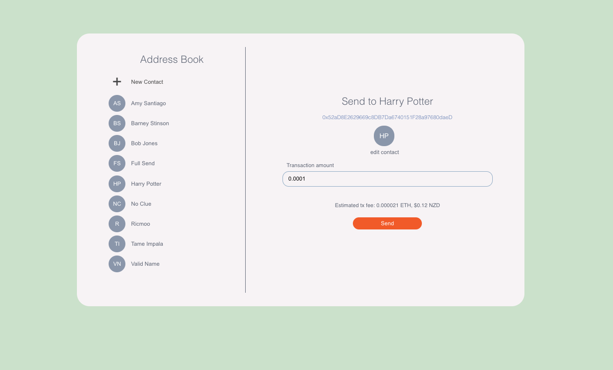

# Metamask Address Book

Metamask Address Book allows you to store your contacs' Ethereum addresses and send them ETH using the Metamask wallet on Rinkeby network.

It's available [here](https://kabece.github.io/metamask-address-book/).

You can use either an address or an ENS name. Before sending a transaction notice the <b>estimate</b> of the fee.

## Tech stack

- React
- TypeScript
- usedapp + ethers.js
- HTML + CSS

## Running locally

Clone the repo and create `.env` file in the root folder. Add your Etherscan API Key as `REACT_APP_ETHERSCAN_API_KEY `.

Run `yarn && yarn start` and you're good to go!
